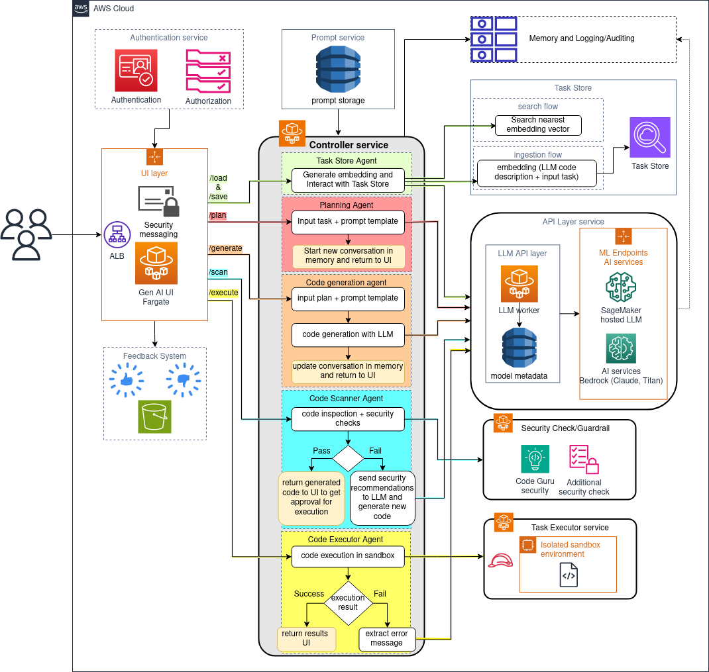

# Codenator 🤖️
**Automatic code generation and execustion using Large Language Models**  
Codenator is a scalible AWS cloud solution for generating, testing, scanning and executing code.
## Codenator in Action

## Features
It currently supports the following features:
- LLM Agent interaction Code generation using *Bedrock* or models hosted on *Amazon SageMaker endpoints*.
- Easy integration with new released models.
- Code security scan with Amazon *CodeGuru* or [*SemGrep*](https://semgrep.dev/).
- Code execution in sandboxed docker container with encrypted input powered by *Amazon KMS*.
- Automatic execution failure feedback and correction.
- Code execution requires manual approval for increased security.
- Task storage and retrieval powered by *Amazon Opensearch Serverless*, to allow interaction with a task at later time.
- Shared storage folder to allow exchanging files between agent and code executor.
## Architecture
 
Below is an overview description of each component. To dive deep into each one, click on the provided link for each componsent.
* [API layer (LLM Service)](src/codenator/api_layer/README.md): Responsible for unifing LLM invocations. It uses *ECS Fragate* and *Amazon DynamoDB* to interact with various LLM service providers and add new ones without the need to change code.
* [Prompt Store](src/codenator/controller/app/prompt/README.md): Powered by *DynamoDB*, enables storage, modification, versioning and retrieval of prompts at runtime.
* [Controller (orchestration layer)](src/codenator/controller/README.md): Holds the the main logic for the Codenator agent and acts as a central component for the solution.  
* WebUI (UI layer): Gradio app web ui.
* [Code Executor (task executor)](src/codenator/code_executor/README.md): Executes code in sandbox, script must be encrypted with *Amazon KMS*. Currently supports *Python*, *Java*, *JavaScript*, *R*, *Julia*, *Bash* and *Shell*.
* [Task store](src/codenator/task_store/README.md): Powered by *Amazon Opensearch Serverless*, to save and retrieve tasks.
* [Code scanner (Security Check/Guradrail)](src/codenator/code_scanner/README.md): Performs static code scanning to detect any vulnerabilities in generated code. Currently supports *Amazon CodeGuru* and *SemGrep* scanners.
* feedback: User feedback hosted on S3.
* logging: Conversation logging to S3.
## Installation Guide
1. Clone [this repository]([https://github.com/aws-samples/codenator-automatic-code-generation-and-execution-using-llm/tree/main](https://github.com/aws-samples/codenator-automatic-code-generation-and-execution-using-llm/tree/main)) on your local device or any ML platform like SageMaker Studio Classic.
2. After cloning the repository, go to `deployment` folder:

	`$ cd codenator-automatic-code-generation-and-execution-using-llm-main/deployment/`
3. Inside `deployment` folder, run `upload-templates.sh` script to upload the required CloudFormation templates to your specified S3 bucket in your current region, replacing *<BUCKET_NAME>* and optionally provide a *<PREFIX>* with your actual bucket name:

	`$ ./upload-templates.sh <BUCKET_NAME> [<PREFIX>]`
5. After uploading the templates to S3, create a certificate in the ACM (AWS Certificate Manager) console. 
6. Then, navigate to the CodeBuild console and select `Create build project` to create a placeholder project. Provide a name for the <**Project name**> field, as this will be used when launching CloudFormation stacks.
7. Next, go to the CloudFormation console and create a new stack, specifying the object URL of the `build-images.yaml` template uploaded previously to your S3 bucket.
	- When specifying the stack details for the CloudFormation stack you are creating from the `build-images.yaml` template, fill in the parameters as follows: 
		- For **ProjectBucket**: Enter the name of the S3 bucket where you uploaded the CloudFormation templates earlier. This is the same bucket you passed to the `upload-templates.sh` script. 
		- For **ProjectName**: Enter the name you gave to the CodeBuild project when creating it in the previous step. This links the build project to the stack. 
		- For **SourceRepo**: Enter the GitHub repo URL where the sample application code is stored: 

			`$ https://github.com/aws-samples/codenator-automatic-code-generation-and-execution-using-llm.git`
8. After the CloudFormation stack finishes creating successfully with a status of **CREATE_COMPLETE**, go back to the CodeBuild console to check on the image build project. 
	- Verify that the latest build status for the images shows as `Succeeded`. 
	- This indicates that the Docker images defined in the buildspec were built properly from the application code linked in the stack.
	- If the build status is anything other than `Succeeded`, check the build logs for errors and troubleshoot as needed.
9. Next, create another stack with `root-template.yaml`.  Fill in the stack parameters as follows: 
	- For **Certificate**: Enter the ARN of the certificate you created earlier in AWS Certificate Manager.
	- For **CognitoUserEmail**: Provide an email address that will receive the temporary password for the Cognito user pool.
	- For **ProjectBucket**: Enter the name of the S3 bucket where you uploaded the templates. This should match what you specified for the previous stack.
	- For **PublicDomainName**: The public domain name can be found in the AWS Certificate Manager console next to the ARN for the certificate you created earlier.
## Security

## Authentication Layer
You can optionally to include an authentication layer to your application, which will enforce all users to get authenticated by Cognito Userpool prior to accessing this application. To use authentication, the following tempaltes will be used:
* [auth-layer.yaml](/deployment/CloudFormation/auth-layer.yaml): This template is used to create Cognito Userpool and App Client to authenticate users coming to Web-UI Application Load Balancer
* [web-ui-auth.yaml](/deployment/CloudFormation/web-ui-auth.yaml): This tempalte is built on top of [web-ui.yaml](/deployment/CloudFormation/root-web-ui-auth.yaml) with following changes to enforce all unauthenticated requests to send to Cognito Userpool for authentication. 
  1. Add HTTPS Listener Rules to enforce unauthenticated requests to get authenticated by Cognito Userpool App Client.
  2. Updates default behaviour of HTTPS Listener to redirect all requests to get authenticated. 
* [root-tempalte-auth.yaml](/deployment/CloudFormation/root-template-auth.yaml): This tempalte is built on top of [root-template](/deployment/CloudFormation/root-template.yaml) with following changes:
  1. Requires `PublicDomainName` and `Certificate` to integrate Cognito Userpool to Web-UI Application Load Balancer
  2. Adds a new nested stack `AuthLayerStack` which 
  3. Adds dependency of `AuthLayerStack` to `WebUIService`

## License

This library is licensed under the MIT-0 License. See the LICENSE file.
